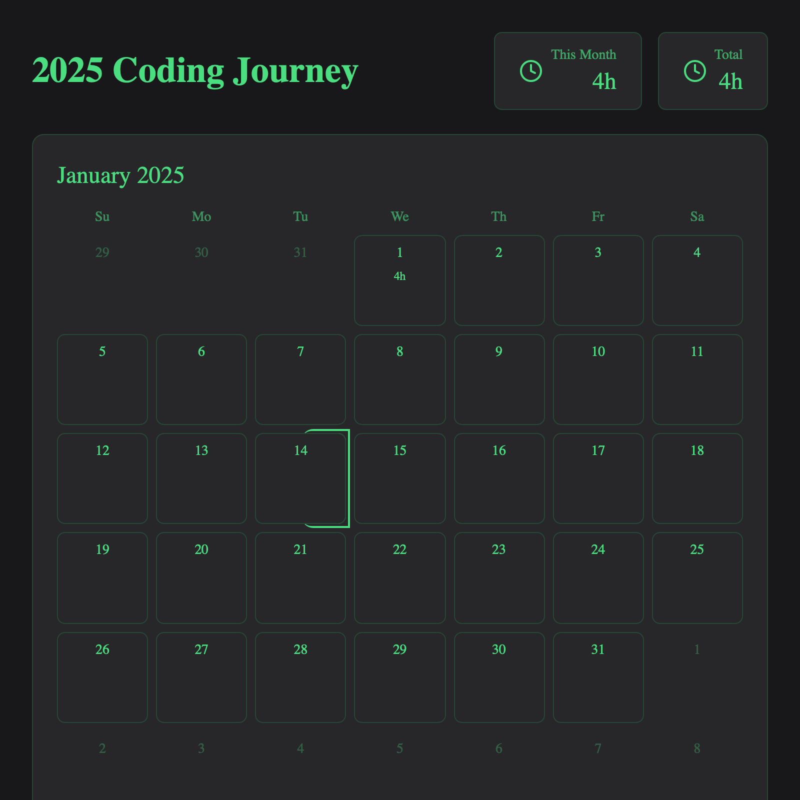

# How Many Hours Did You Code? 📊

A beautiful and interactive web application to track your coding hours throughout 2025. Built with React, TypeScript, and Tailwind CSS.



## ✨ Features

- 📅 Interactive calendar view with daily coding hours
- ⚡ Quick add buttons for common hour increments
- 📝 Manual entry with date selection
- 📊 Monthly and yearly statistics
- 📏 Date range selection to view hours between dates
- 🗑️ Easy deletion and modification of entries
- 📱 Fully responsive design
- 🐦 Direct sharing to Twitter with statistics
- 💾 Local storage persistence
- 🌙 Dark mode design

## 🚀 Getting Started

### Prerequisites

- Node.js (v18 or higher)
- npm or yarn

### Installation

1. Clone the repository:
```bash
git clone https://github.com/achalbajpai/how-many-hours-did-you-code.git
cd how-many-hours-did-you-code
```

2. Install dependencies:
```bash
npm install
# or
yarn
```

3. Start the development server:
```bash
npm run dev
# or
yarn dev
```

4. Open [http://localhost:5173](http://localhost:5173) in your browser.

## 🛠️ Built With

- [React](https://reactjs.org/) - UI Framework
- [TypeScript](https://www.typescriptlang.org/) - Type Safety
- [Vite](https://vitejs.dev/) - Build Tool
- [Tailwind CSS](https://tailwindcss.com/) - Styling
- [Lucide Icons](https://lucide.dev/) - Icons
- [html-to-image](https://github.com/bubkoo/html-to-image) - Image Export

## 📝 Usage

1. **Quick Add Hours**: Use the + and - buttons or quick add presets to log hours for today
2. **Manual Entry**: Select a date and hours to log for past dates
3. **Calendar View**: Click on any date to see quick add options
4. **Date Range**: Click two dates to see total hours between them
5. **Export**: Save your calendar as PNG or share directly to Twitter
6. **Recent Entries**: View and manage your recent logs

## 🤝 Contributing

Contributions are welcome! Please feel free to submit a Pull Request.

1. Fork the repository
2. Create your feature branch (`git checkout -b feature/AmazingFeature`)
3. Commit your changes (`git commit -m 'Add some AmazingFeature'`)
4. Push to the branch (`git push origin feature/AmazingFeature`)
5. Open a Pull Request

## 📜 License

This project is licensed under the MIT License - see the [LICENSE](LICENSE) file for details.

## 👤 Author

**Achal Bajpai**

* Github: [@achalbajpai](https://github.com/achalbajpai)

## ⭐️ Show your support

Give a ⭐️ if this project helped you!
